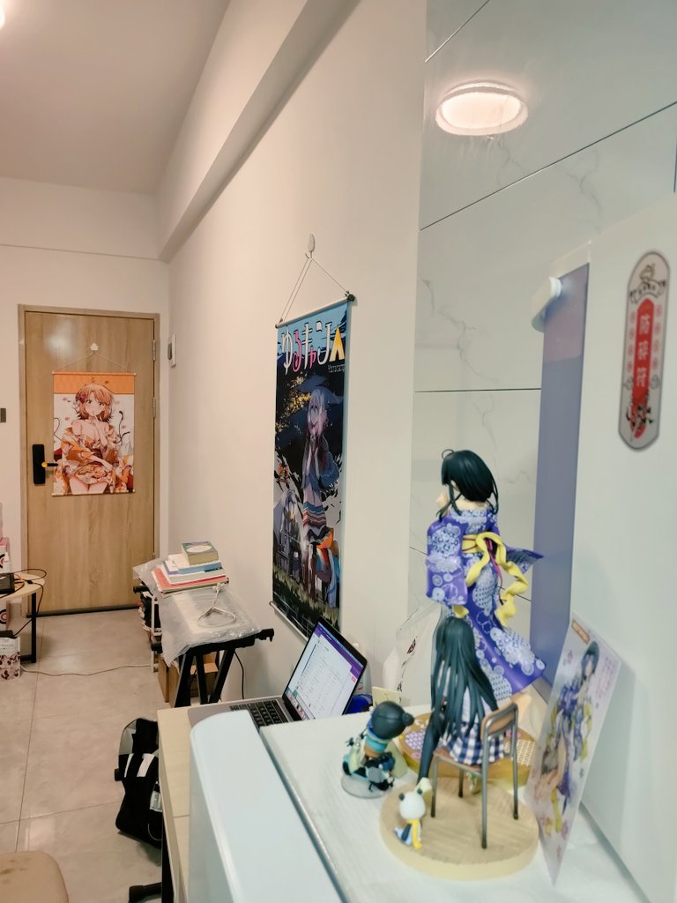

>更新：2022/1/22

## 闲言碎语

一晃一年又是过去了，这个新年，全球疫情再创新高，圣诞节后美国单日新增更是直接突破 ~~50 万直逼 60 万大关❌~~ **100 万✅**，国内也有西安管理不力导致民众忍饥挨饿。

新冠已经两年多了啊。

言归正传，我今年年初从 W 公司离职后，非常幸运地进了现在的公司——大宇无限，在融入大宇的过程中也是五味杂陈。
不过总体结果还是挺满意的，目前工作已经步入正轨，也发现了非常多的机会，大宇的基础设施领域仍然大有可为。

一些重要事情还是没怎么想通，不过毕竟风口上的猪都能飞，今年小小努力了一把，大部分时间仍然随波逐流，却也渐入佳境。

## 生活

- 1 月的时候从博客园迁移到这个独立博客，还认识了 [@芝士](https://chee5e.space/)，芝士帮我调整好了博客「友链」页面的样式，超级感谢~
- 2 月的时候从 W 公司离职，然后怎么说呢，瞬间感觉海阔天空，心态 180 度转变，好得不得了，但是其实也很担心自己各方面的不足。总之心里有好多的想法，跟 [@是格子啊](https://sanshiliuxiao.top/)、[@芝士](https://chee5e.space/) 以及前同事聊了好多，非常感谢这几位朋友跟同事帮我梳理思路，给我肯定。也是这个时间点，我被 [@芝士](https://chee5e.space/) 拉进了中文 twitter 的圈子。
- 过年响应号召没回家（其实是嫌核酸检测麻烦，家里也建议先别回），每天爬爬山看看风景，买了个吊床去公园午睡，练习口琴竹笛，就这样玩了一个月。
  - 
- 到了 3 月份的时候我开始找工作，面了几家公司后，非常幸运地进入了大宇无限，成为了一名 SRE 萌新。在大宇一年的感受，就放在后面的「工作」部分写了，这里先略过。
  - 加入大宇后，全年都有定期的团建，跟 SRE 小伙伴公款吃喝，我 2021 年下馆子次数估计是上一年的七八倍
- 3 月底，看了电影——《寻龙传说》（2021 年看的唯一一部电影），片尾曲超好听。
- 4 月份，各种巧合下，意外发现初中同学住得离我 1km 不到，在他家吃了顿家乡菜，还有杨梅酒，味道非常棒！还有回甘强烈的城步青钱柳茶，让我念念不忘。
- 8 月份，堂弟来深圳暑期实习，跟两个堂弟一起穿越深圳东西冲海岸线，风景非常棒，不过路上也是又热又渴
- 10 月份
  - 加入了大宇的冲浪小分队，第一次冲浪、海边烧烤
  - 买了双轮滑鞋，学会了倒滑、压步转向，复习了大学时学过的若干基础技巧
- 12 月，买了台云米泉先净饮机后，有了随时随地的矿物质热水，就想起了 4 月份在初中同学家喝过的青钱柳，然后就喝茶上瘾了，一桌子的滇红、祁门红茶、安吉白茶、黄山毛峰、青钱柳、莓茶、梅子菁...目前感觉滇红跟祁门红茶最好喝，安吉白茶跟黄山毛峰都非常清香，青钱柳回甘最强烈，莓茶怎么说呢味道感觉不太好（也可能是泡的手法不对？）
  - 
  - 
- 2022 年 1 月，第一次买动漫手办，妆点后感觉房间都增色不少~
  - 

## 读书

- 年初辞职后游山玩水，心思稍微安定了些，看了大半本《走出荒野》。
- 6 月份社区组织打新冠疫苗时，在等候室看了本《青春驿站——深圳打工妹写真》，讲述八九十年代打工妹的生活。很真实，感情很细腻。
- 年末二爷爷去世，参加完葬礼后，心态有些变化，看完了大一时买下的《月宫 Moon Palace》，讲述主角的悲剧人生。
- 其余大部分业余时间，无聊，又不想学点东西，也不想运动，于是看了非常多的网络小说打发时间。

## 音乐

年初辞职后，练了一段时间的竹笛跟蓝调口琴，但后来找到工作后就基本沉寂了。

总的来说还是原地踏步吧。

## 工作 - 我在大宇无限的这一年

3 月份刚进大宇的我充满好奇，但也小心谨慎，甚至有点不敢相信自己能进到一家这么棒的公司，感觉自己运气爆棚。
毕竟大宇无论是同事水平还是工作氛围，亦或是用户体量，相比我上家公司都是质的差别。

之后慢慢熟悉工作的内容与方法，leader 尽力把最匹配我兴趣的工作安排给我，帮我排疑解难，同时又给我极大的自主性，真的是棒极了。

然而自主性高带来的也是更高的工作难度，遇到困难时也曾手忙脚乱、迷茫、甚至自我怀疑，很担心是不是隔天就得跑路了...（是的我抗压能力有点弱）
但好在我终究还是能调节好心态，负起责任，一步步把工作完成。
中间有几次工作有延误时，leader 还陪我加班，事情干完后又带我去吃大餐犒劳自己，真的超级感谢他的帮助与支持。

这样经历了几个项目的洗礼后，现在我终于能说自己是脚踏实地了，心态从「明天是不是得提桶跑路」转变成了「哇还有这个可以搞，那个 ROI 也很高，有好多有趣的事可以做啊」，我终于能说自己真正融入了大宇无限这家公司，成为了它的一员。

回看下了 2020 年的总结与展望，今年实际的进步，跟去年期望的差别很大。最初的目标大概只实现了 10%，但是接触到了许多意料之外的东西，总体还是满意的：

- 熟悉了新公司的文化与工作方式，这感觉是个很大的收获，我的工作方式有了很大的改善
- 接触并且熟悉了新公司的 AWS 线上环境
  - 负责维护线上 Kubernetes 管理平台，第一次接触到的线上集群峰值 QPS 就有好几万。从一开始的小心翼翼，到现在也转变成了老手，这算是意义重大吧
  - 使用 python 写了几个 Kubernetes 管理平台的服务，这也是我第一次写线上服务，很有些成就感
  - 下半年在 AWS 成本的分析与管控上花了很多精力，也有了一些不错的成果，受益匪浅
  - 学会了 Nginx 的简单使用，刚好够用于维护公司先有的 Nginx 代理配置
- 主导完成了「新建 K8s 集群，将服务迁移到新集群」。虽然并不是一件很难的事，但这应该算是我 2021 年最大的成就了。
  - 升级过程中也是遇到了各种问题，第一次升级迁移时我准备了好久，慌的不行，结果升级时部分服务还是出了问题，当时脑子真的是个懵的，跟 leader 搞到半夜 1 点多后还是没解决，回退到了旧集群，升级失败。之后通过测试确认到是某个服务扩缩容震荡导致可用率无法恢复，尝试通过 HPA 的 behavior 来控制扩缩容速率，又意外触发了 K8s HPA 的 bug 把集群控制面搞崩了... 再之后把问题都确认了，第二次尝试升级，又是有个别服务可用率抖动，调试了好几天。那几天神经一直紧绷，每天早上都是被服务可用率的告警吵醒的。跨年的那天晚上业务量上涨，我就在观察服务可用率的过程中跨年了。这样才终于完成了 K8s 集群的升级，期间各位同事也有参与帮忙分析排查各种问题，非常感谢他们，还有努力的我自己。
- 随便写了几个 go 的 demo，基本没啥进步
- 学了一个星期的 rust 语言，快速看完了 the book，用 rust 重写了个 video2chars
- 学习了 Linux 容器的底层原理：cgroups/namespace 技术，并且用 go/rust 实现了个 demo
- 学习了 Linux 的各种网络接口、Iptables
- 熟悉了 PromQL/Grafana，现在也能拷贝些 PromQL 查各种数据了

如果要给自己打分的话，那就是「良好」吧。因为并没有很强的进取心，所以出来的结果也并不能称之为「优秀」。

顺便公司的新办公区真的超赞，详情见我的 twitter：

<blockquote class="twitter-tweet">
新办公区真好呐～  值此良辰美景，好想整个榻榻米坐垫，坐在角落的落地窗边工作🤣 那种使用公共设施工（mo）作（yu）的乐趣，以及平常工位见不到的景色交相辉映，是不太好表述的奇妙体验 <a href="https://t.co/FASffzw8N3">pic.twitter.com/FASffzw8N3</a>
&mdash; ryan4yin | 於清樂 (@ryan4yin) <a href="https://twitter.com/ryan4yin/status/1482891448731070466?ref_src=twsrc%5Etfw">January 17, 2022</a></blockquote>  

## 技术方面的感受

- Istio 服务网格：体会到了它有点重，而且它的发展跟我们的需求不一定匹配
  - Sidecar 模式的成本比较高，在未调优的情况下，它会给服务带来 1/3 到 1/4 的成本提升，以及延迟上升
  - 比如切量权重固定为 100（新版本将会放宽限制），不支持 pod 的 warm up（社区已经有 PR，持续观望吧）
  - 而它重点发展的虚拟机支持我们却完全不需要
  - 一直在思考是持续往 Istio 投入，还是换其他的方案
- 服务网格仍然在快速发展，未来的趋势应该是 eBPF + Envoy + WASM
  - Cilium 推出的基于 eBPF 的 Service Mesh 是一个新趋势（它使用高级特性时会退化成 Per Node Proxy 模式），成本、延迟方面都有望吊打 Sidecar 模式的其他服务网格，是今年服务网格领域的大新闻。
  - 我们曾尝试使用中心化网关来替代 Sidecar 以降低成本。但是跨区流量成本、HTTP/gRPC 多协议共存，这些都是挑战。而且这也并不是社区的最佳实践，现在我觉得维持 Sidecar 其实反而能提升资源利用率，我们的集群资源利用率目前很低。如果能把控好，这部分成本或许是可以接受的。
- K8s 集群的日志方面，我们目前是使用自研的基于 gelf 协议的系统，但是问题挺多的
  - 从提升系统的可维护性、易用性等角度来说，loki 是值得探索下的
- K8s 集群管理方面，觉得集群的升级迭代，可以做得更自动化、更可靠。明年可以在多集群管理这个方向上多探索下。
- [Pod 服务质量](https://kubernetes.io/docs/tasks/configure-pod-container/quality-service-pod/)：对非核心服务，可以适当调低 requests 的资源量，而不是完全预留(`Guaranteed`)，以提升资源利用率。
- 官方的 HPA 能力是不够用的，业务侧可能会需要基于 QPS/Queue 或者业务侧的其他参数来进行扩缩容，需要持续关注 [KEDA](https://github.com/kedacore/keda) 这个项目。
- 成本控制方面，体会到了 ARM 架构以及 Spot 竞价实例的好处
- 跨区流量成本有很大的潜在优化空间
  - 跨区流量成本是在两边都会收费，而且不仅涉及 Kubernetes 集群内服务间的调用，还会涉及对 RDS/ES/ElastiCache/EC2 等其他资源的调用。
- 今年各云厂商故障频发，没有**跨 region 的服务迁移**就会很难受，需要持续关注下 [karmada](https://github.com/karmada-io/karmada) 这类多集群管理方案。
  - Google 账号系统宕机
  - Fastly CDN 故障
  - Facebook 故障
  - AWS 更是各种可用区故障，12/7 的故障导致 AWS 大部分服务都崩了。因此我们 SRE 今年经常是救各种大火小火...
- Rust/Go/WASM 蓬勃发展，未来可期。
- AI 落地到各个领域，影响到了我们日常使用的语音导航、歌声合成、语音合成等多个领域，当然也包括与 SRE 工作相关的场景：AIOps

## 2022 年的展望

### 技术侧

今年的展望写得更聚焦一些，争取能实现 50%，就是很大的突破了。

1. 熟练掌握 Go/Rust 语言，并分别用于至少两个项目中
   1. 打铁还需自身硬，编码能力是基础中的基础。
2. 深入学习如下技术
   1. Kubernetes 源码
3. 网络技术
   1. 服务网格 Istio
   2. 代理工具 Envoy/APISIX
   3. 网络插件 Cilium + eBPF
4. AWS K8s 成本与服务稳定性优化
   1. 节约跨可用区/跨域的流量成本
     1. K8s 新特性：[Topology Aware Hints](https://kubernetes.io/docs/concepts/services-networking/topology-aware-hints/)
     2. Istio: [Locality Load Balancing](https://istio.io/latest/docs/tasks/traffic-management/locality-load-balancing/)
   2. 实例类型优化：
      1. 使用更合适的实例类型
      2. 使用 ARM 架构机型，降本增效
   3. 推广 GRPC 协议
5. 打通本地开发环境与云上的运行环境：
   1. [nocalhost](https://github.com/nocalhost/nocalhost)
6. 探索新技术与可能性（优先级低）
   1. 基于 Kubernetes 的服务平台，未来的发展方向
      1. kubevela
      2. buildpack
      3. 是否应该推进 gitops
      4. openkruise
   2. Serverless 平台的进展
      1. Knative
      2. OpenFunction
   3. 跨集群的应用部署、容灾
      1. karmada
   4. 机器学习、深度学习技术：想尝试下将 AI 应用在音乐、语音、SRE 等我感兴趣的领域，即使是调包也行啊，总之想出点成果...

可以预料到明年 SRE 团队有超多的机会，这其中我具体能负责哪些部分，又能做出怎样的成果，真的相当期待~

### 生活侧

- 运动：
  - 把轮滑练好，学会点花样吧，每个月至少两次。
  - 进行三次以上的次短途旅行，东西冲穿越可以再来一次。
- 音乐：
  - 再一次学习乐理...
  - midi 键盘买了一直吃灰，多多练习吧
  - 买了个 Synthesizer V  Stduio Pro + 「青溯 AI」，新的一年想学下调教，翻唱些自己喜欢的歌。
- 阅读：清单如下，一个月至少读完其中一本。
  - 文学类：
    - 《人间失格》：久仰大名的一本书，曾经有同学力荐，但是一直没看。
    - 《生命最后的读书会》：或许曾经看过，但是一点印象都没了
    - 《百年孤独》：高中的时候读过一遍，但是都忘差不多了
    - 《霍乱时期的爱情》
    - 《苏菲的世界》：据说是哲学启蒙读物，曾经看过，但是对内容完全没印象了。
    - 《你一生的故事》：我也曾是个科幻迷
    - 《沈从文的后半生》
    - 《我与地坛》
    - 《将饮茶》
    - 《吾国与吾民 - 林语堂》
    - 《房思琪的初恋乐园》
  - 人文社科
    - 《在生命的尽头拥抱你-临终关怀医生手记》：今年想更多地了解下「死亡」
    - 《怎样征服美丽少女》：哈哈
    - 《爱的艺术》
    - 《社会心理学》
    - 《被讨厌的勇气》
    - 《人体简史》
    - 《科学革命的结构》
    - 《邓小平时代》
    - 《论中国》
    - 《刘擎西方现代思想讲义》
    - 《时间的秩序》
    - 《极简宇宙史》
    - 《圆圈正义-作为自由前提的信念》
    - 《人生脚本》
  - 技术类
    - 《复杂》
    - 《SRE - Google 运维解密》
    - 《凤凰项目：一个 IT 运维的传奇故事》
    - 《人月神话》
    - 《绩效使能：超越 OKR》
    - 《奈飞文化手册》
    - 《幕后产品-打造突破式思维》
    - 《深入 Linux 内核架构》
    - 《Linux/UNIX 系统编程手册》
    - 《重构 - 改善既有代码的设计》
    - 《网络是怎样连接的》：曾经学习过《计算机网络：自顶向下方法》，不过只学到网络层。就从这本书开始重新学习吧。

## 结语

2021 年初朋友与我给自己的期许是「拆破玉笼飞彩凤，顿开金锁走蛟龙」，感觉确实应验了。

今年我希望不论是在生活上还是在工作上，都能「更上层楼」~

>更多有趣的、有深度的 2021 年度总结：<https://github.com/saveweb/review-2021>
